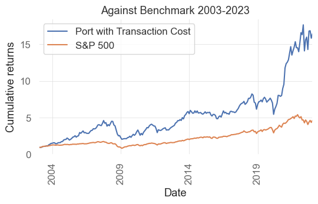
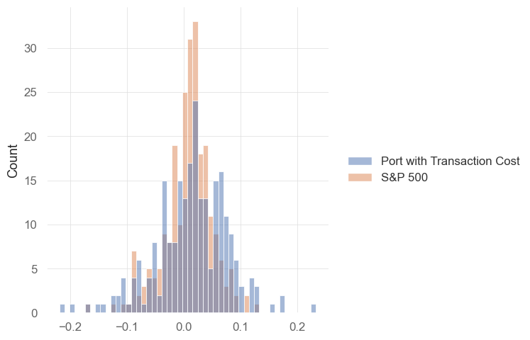
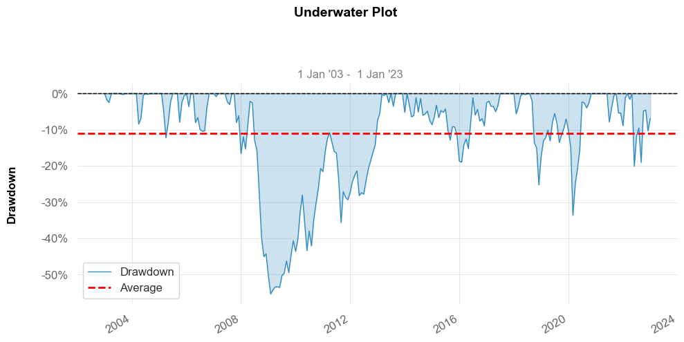
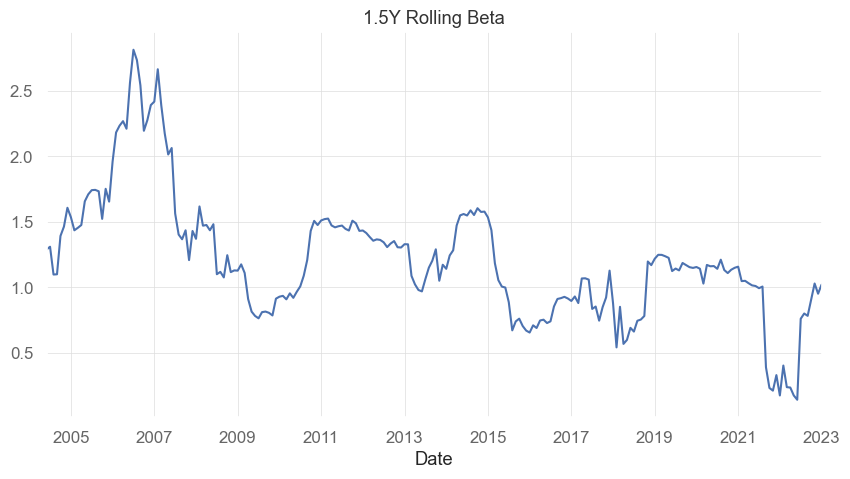
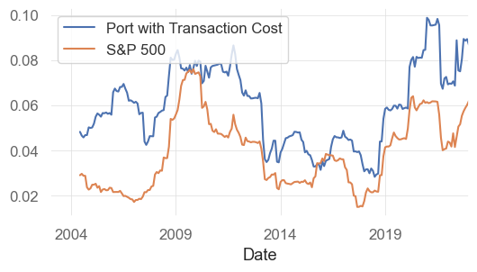
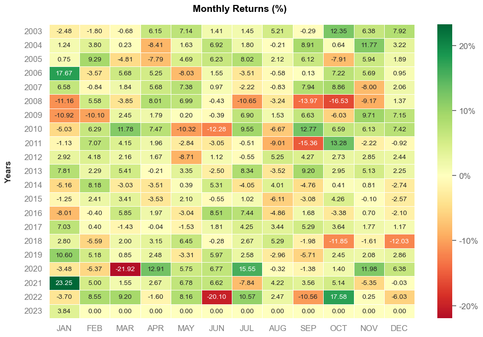

# Project-1 12-Month Momentum Investment Strategy

## Background

Beating the market has always been the final and sole goal of every investor who takes an active approach to investing, rather than following the stock market index tracking indices (passive). In this project, we try to pursue our investment strategy on cross-sectional momentum, to create a superior, robust and outperforming portfolio. We use a mix of libraries, packages and API to provide us the most suitable data as well as organize the findings in a sophisticated and presentable method.    

#### Rationale
The momentum premium (the amount momentum strategies work over the market) is well documenated in academia, and we look to test that on our universe of approximately 2500 NYSE listed stocks. One important feature of quantitative investment strategies is the economic rationale behind why it works (if it does), as otherwise people can be critical of potential data-mining or a 'black-box' approach with no intuition. The momentum factor generally is one that falls into the bucket of a 'behavioural anomly', as intuitively one can deduct that there is probably information in the trends of moving prices or fundamentals. For example, one of the most common behavioural reasonings is "investor herding", where investors tend to overreact to a trend and get overconfident about a particular asset, driving prices up even further than they should be (and vice versa with underreaction in selling a stock). 

## Base Strategy 

1. Collect the closing prices of active stock on the NYSE that can be dated back to 2002
2. Clean up dataframe e.g. remove nulls and transform the index - ultimately reduce the data in dataframe to usable stocks

**Creating Momentum Scores:**

3. Calculate 12-month return for each stock ticker
4. Sort the values and find the top 100 best performing, each month
5. Every month, rebalance the portfolio to the 100 best performing stocks (ranked by momentum) from the sorted data.

6. Calculate monthly returns for the portfolio by matching the tickers each month on the portfolio to the tickers in the monthly returns dataframe (Implement a base 0.5% Transaction cost for each monthly return).
7. Collect S&P 500 Closing price data and calculate returns to use as a benchmark.
9. Compare and visualize both investment returns
10. Re-run the backtest with different parameters to maximise Sharpe Ratio (e.g. look-back period, concentration)

## Technology Used
1. alpaca API (gathering ticker)
2. yahoo Finance (collecting prices from each ticker)
3. pandas
4. numpy
5. request
6. quandl 
7. math
8. hvplot
9. datetime
10. os
11. quantstats (visualization of findings)
12. sklearn.linear_model (regression analysis)
13. statsmodel (regression analysis)

## Findings

-  **Key Stats**

Though the strategy witnessed strong volatility, the the risk-adjusted return (sharpe) of this strategy immensely outperformed the S&P 500 and almost yields twice as much returns on a cumulative basis over ~20 years.

- **Performance Cumulative Returns**

- **Comparison Distribution of Returns** 

As can be seen, our strategy is more volatile than S&P 500. There are moments where our return could draw down by 20% and jump in similar magnitude, while S&P 500 max monthly drop and increase is only  10%

- **Distribution with SNS**

- **Max Drawdown** 

Two major drawdown occured during 2008 and 2020 where global financial crisis and COVID-19 pandemic took place.

- **Rolling Beta**

- **Rolling Volatility**

Similar to other indication, our strategy pose extra risk and may not suitable for risk-averse investor

- **What happens when you change some parameters in the model? - Sharpe Ratio**

This graph illustrates the outcome of how different a variety of lookbacks, as well as concentration levels, can influence the returns. Taking a greater concentration in stocks reduces diversification but may increase your risk-adjusted return. In our case, it seems that 6 or 12 months is the best, but the added diversification that 100 stocks gives seems to be the better bet as there isn't a huge benefit for concentrating the portfolio more. Also, it's best for us to stick with 12 months lookback, as it provides the more robust results.

- **All Monthly Returns**

We have most months with positive returns, with a few major drawdowns during recessioniary environments.

## Member
- Abigail
- Albertyo
- John
- Luis

