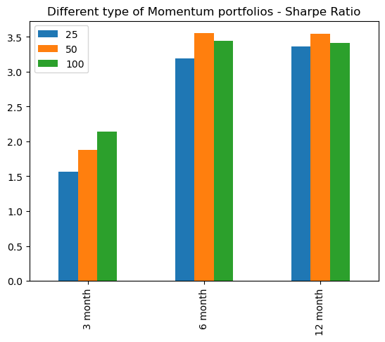
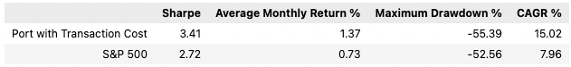

# Project-1 12-Month Momentum Investment Strategy

## Background

Beating the market has always been the final and sole goal of every investor who has diverted planning rather than following the stock market index tracking indices. In this project, we try to pursue our investment strategy on momentum trend to create a balance and unbiased portfolio. We use a mix of libraries, packages and API to provide us the most suitable data as well as organize the findings in a sophisticated and presentable method.    

## Base Strategy 

1. Collect the closing prices of active stock in NYSE that can be dated back to 2002
2. Clean up dataframe e.g. remove nulls and transform the index - ultimately reduce the data in dataframe
3. Calculate annual return from each stock ticker
4. Sort the values and find the top 100 best performing from each month 
5. Build and reconstruct the monthly portfolio from the sorted data, then substract it by 0.5% of the monthly return as transactional cost 
6. Similar to procedure above, grab the 12-month return of a comparable **benchmark** from 2002, which in our case we use S&P 500 or 500 largest trading US companies
7. Compare and visualize both investment returns
8. Backtest the strategy with different variables

## Technology Used
1. alpaca API (gathering ticker)
2. yahoo Finance (collecting prices from each ticker)
3. pandas
4. numpy
5. request
6. quandl 
7. math
8. hvplot
9. datetime
10. os
11. quantstats (visualization of findings)
12. sklearn.linear_model (regression analysis)
13. statsmodel (regression analysis)

## Screeshots of Findings

- **Comparison Distribution of Returns** 

As can be seen, our strategy is more volatile than S&P 500. There are moments where our return could draw down by 20% and jump in similar magnitude, while S&P 500 max monthly drop and increase is only  10%

- **Distribution with SNS**

- **Max Drawdown** 

Two major drawdown occured during 2008 and 2020 where global financial crisis and COVID-19 pandemic took place.

- **Rolling Beta**

- **Rolling Volatility**

Similar to other indication, our strategy pose extra risk and may not suitable for risk-averse investor

- **Sharpe Ratio**

This graph illustrates the outcome of how different a variety of lookbacks can influence the returns - it's best for us to stick with 12 months lookback.

-  **Stats**

Though the strategy witnessed strong volatility, the returns of this strategy immensely outperform S&P 500 and almost become twice bigger in average.

- **All Monthly Returns**

- **Performance Cumulative Returns**

## Member
- Abigail
- Albertyo
- John
- Luis

